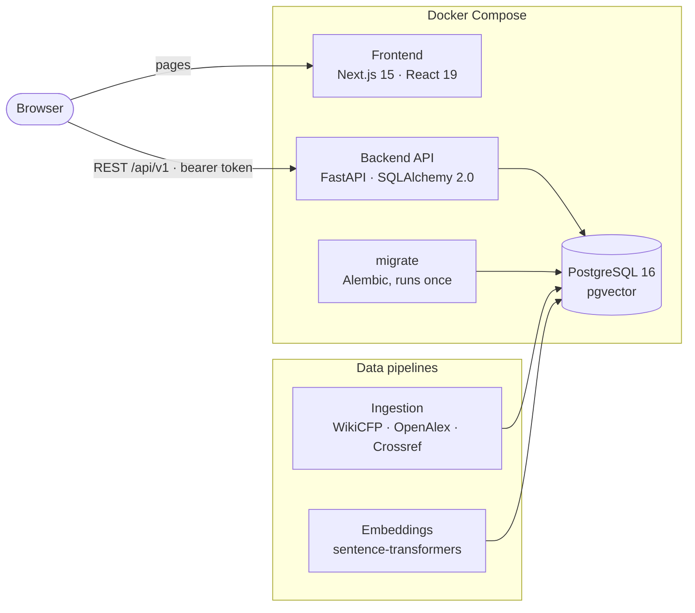

<div align="center">

# ResearchConnect AI

**An intelligent platform that helps students, researchers and faculty discover, evaluate and
manage academic opportunities: conferences, journals, calls for papers, workshops,
research positions and collaborators.**


[](LICENSE)

[Features](#features) · [Architecture](#architecture) · [Quick Start](#quick-start) ·
[Development](#local-development) · [Documentation](#documentation)

</div>

---

## Overview

Researchers lose time sifting through scattered calls for papers, unclear deadlines and
predatory venues. ResearchConnect AI brings these into one place and adds intelligence on
top: hybrid semantic search, venue risk assessment, deadline reasoning and recommendations
personalized to each researcher, followed by the tools to plan, track and collaborate on
submissions.

Every ranking, risk and deadline decision is **deterministic and explainable**. The system
makes no LLM calls and no network requests while ranking, and every score can be traced back
to the evidence behind it.

## Features

**Discovery and search**
- Hybrid search that fuses PostgreSQL full-text search with pgvector semantic similarity
  (384-dimensional `all-MiniLM-L6-v2` embeddings) through Reciprocal Rank Fusion
- Academic query understanding (acronym expansion, taxonomy-aware matching), similar-research
  retrieval, and research-to-opportunity matching
- Explainable results: every ranked item shows which signals placed it there

**Trust and deadline intelligence**
- Deterministic predatory-venue risk scoring from textual, publisher and indexing evidence
  (DOAJ, Crossref, OpenAlex), with a trust graph and human-readable explanations
- Deadline intelligence: evidence extraction, UTC and Anywhere-on-Earth normalization,
  conflict and extension resolution, and urgency tiers

**Personalized recommendations**
- Researcher profiles, interests and explicit preferences, combined with adaptive signals
  learned from feedback
- Bounded personalization: adjustments are capped so they never override relevance, and
  high-risk or expired opportunities can never be boosted
- Calibration, quality measurement and governance with drift detection, plus researcher-facing
  transparency ("Why this recommendation?") and controls to pause or reset personalization

**Research management and collaboration**
- Opportunity workspace that follows each opportunity from *saved* to *accepted*
- Submission tracking with versioned documents and readiness checks
- Research calendar with iCal export, deadline reminders and a notification center
- Shared workspaces with roles, invitations, tasks and an activity feed

**Academic community**
- Faculty research postings, internships and research-assistant openings with an application
  workflow
- Opt-in peer and co-author discovery with field-level privacy controls

**Platform**
- Account registration and sign-in, role-based access (Student, Faculty, Admin), and an
  administration console
- Full-stack Docker Compose deployment, optional background scheduler, and a validated
  production configuration

## Architecture



The browser loads pages from the Next.js server and calls the REST API directly with a signed
bearer token. The backend is a modular monolith. Its main modules:

| Module | Responsibility |
|---|---|
| `app/api` | Versioned REST endpoints, one shared identity dependency, role checks |
| `app/search`, `app/repositories` | Lexical and vector retrieval, query intelligence, rank fusion |
| `app/ranking` | Hybrid ranking, diversity re-ranking, risk engine, deadline engine |
| `app/personalization` | Preference interpretation, scoring, adaptive signals, calibration, governance, transparency |
| `app/services` | Domain services for researchers, workspaces, submissions, calendar, notifications, postings |
| `app/scheduler` | Optional background jobs: deadline expiry, reminders, signal and governance refresh, ingestion |

**Design principles**
- **Deterministic and explainable.** The same inputs always produce the same ranking, and every
  score carries its evidence.
- **Relevance and safety first.** Personalization is bounded, and risk or expiry can never be
  outweighed by preference.
- **Single source of truth.** Research management and personalization consume the canonical
  risk, deadline and researcher-intelligence outputs rather than recomputing them.
- **Strict ownership.** Every researcher's data is scoped to the signed-in account and checked
  on every request.
- **No premature scaling.** A modular monolith on PostgreSQL, without message brokers or an
  orchestration layer.

## Technology Stack

| Layer | Technologies |
|---|---|
| Frontend | Next.js 15 (App Router), React 19, TypeScript, CSS design tokens |
| Backend | Python 3.13, FastAPI, Pydantic v2, SQLAlchemy 2.0, Alembic |
| Database | PostgreSQL 16 with pgvector: HNSW vector indexes and GIN full-text indexes |
| Machine learning | sentence-transformers (`all-MiniLM-L6-v2`), deterministic scoring engines |
| Data sources | WikiCFP (scraped), OpenAlex and Crossref APIs |
| Security | JWT (HS256) bearer tokens, bcrypt password hashing |
| Testing | pytest (1,538 tests), Vitest (158 tests) |
| Deployment | Docker Compose, hardened non-root images |

## Quick Start

The whole stack runs with Docker; only Docker (with Compose) is needed on the host.

**1. Clone and configure**

```bash
git clone https://github.com/FuricBond/Research-Connect-AI.git
cd Research-Connect-AI
cp .env.example .env
```

Set the two required values in `.env`, `POSTGRES_PASSWORD` and `AUTH_SECRET_KEY`. Generate each
with:

```bash
python -c "import secrets; print(secrets.token_urlsafe(48))"
```

**2. Start the stack**

```bash
docker compose up --build -d --wait
```

The first build takes several minutes; later starts take seconds. Database migrations run
automatically before the API starts.

| Service | Address |
|---|---|
| Web application | http://localhost:3000 |
| REST API | http://localhost:8000 |
| PostgreSQL | `127.0.0.1:5432` |

**3. Load demo data (optional)**

```bash
docker compose exec backend python -m scripts.seed_demo_data --password '<choose a password>'
```

This creates three accounts, a faculty member, a student and an administrator, along with
sample opportunities, preferences and research postings. Sign in at
http://localhost:3000/login as `demo.faculty@researchconnect.test`,
`demo.student@researchconnect.test` or `demo.admin@researchconnect.test` with the password you
chose.

<details>
<summary><b>Everyday commands</b></summary>

| Task | Command |
|---|---|
| Status and health | `docker compose ps` |
| Logs | `docker compose logs backend` (or `frontend`, `postgres`, `migrate`) |
| Stop, keeping data | `docker compose down` |
| Rebuild after code changes | `docker compose up --build -d --wait` |
| Reset the demo data | `docker compose exec backend python -m scripts.seed_demo_data --reset --password '<password>'` |
| Database shell | `docker compose exec postgres psql -U researchconnect -d researchconnect` |
| Delete all data | `docker compose down -v` |

</details>

## Local Development

Run the database in Docker and the backend and frontend on the host for fast reloads.
Requirements: Python 3.11+ (3.13 recommended), Node.js 20+, and Docker.

**Database**

```bash
cp .env.example .env          # set POSTGRES_PASSWORD and AUTH_SECRET_KEY
docker compose up -d postgres
```

**Backend**

```bash
python -m venv .venv
source .venv/bin/activate     # Windows: .venv\Scripts\Activate.ps1
pip install -r backend/requirements.txt

cd backend
cp .env.example .env          # set the DATABASE_URL password to POSTGRES_PASSWORD
alembic upgrade head
python -m scripts.seed_demo_data   # optional: demo accounts use the password DemoPass123!
uvicorn app.main:app --reload --port 8000
```

`sentence-transformers` installs PyTorch. For a smaller CPU-only install, first run
`pip install --index-url https://download.pytorch.org/whl/cpu torch`. Semantic search also
needs embeddings, generated offline with `python -m ml.embeddings.generate_embeddings`.
Without them, search falls back to lexical ranking.

In development, interactive API documentation is served at http://localhost:8000/docs.

**Frontend**

```bash
cd frontend
npm install
npm run dev                   # http://localhost:3000
```

**Calling the API**

```bash
curl -X POST http://localhost:8000/api/v1/auth/login \
  -H "Content-Type: application/json" \
  -d '{"email": "demo.faculty@researchconnect.test", "password": "DemoPass123!"}'
```

Send the returned `access_token` as `Authorization: Bearer <token>` on protected endpoints.

## Configuration

Docker Compose reads the root `.env` (template: `.env.example`). A backend run on the host reads
`backend/.env` (template: `backend/.env.example`).

| Variable | Default | Purpose |
|---|---|---|
| `POSTGRES_PASSWORD` | *required* | Database password (letters, digits and `- _ . ~` only) |
| `AUTH_SECRET_KEY` | *required* | Token signing secret, at least 32 characters |
| `APP_ENV` | `production` in Compose | `development`, `test` or `production`. Production refuses insecure settings at startup |
| `CORS_ORIGINS` | localhost:3000 | Exact browser origins allowed to call the API |
| `NEXT_PUBLIC_API_URL` | `http://localhost:8000` | API address as seen by the browser; set at frontend build time |
| `API_DOCS_ENABLED` | off in production | Serve `/docs`, `/redoc` and `/openapi.json` |
| `SCHEDULER_ENABLED` | `false` | Run the background maintenance jobs |
| `LOG_LEVEL` / `LOG_FORMAT` | `INFO` / `text` | Logging verbosity; `json` for structured logs |

The complete reference, including every production rule and a deployment checklist, is in
[Production Configuration](docs/architecture/phase6-4-production-configuration.md).

## Testing

```bash
cd backend
pytest                        # 1,538 tests: unit, integration, invariants, security, performance
```

```bash
cd frontend
npm test                      # 158 Vitest tests
npm run type-check
npm run lint
npm run build
```

Backend tests run offline against in-memory databases. Tests that need PostgreSQL use the
database in `DATABASE_URL` and skip when it is unreachable. Set
`RUN_POSTGRES_MIGRATION_TESTS=1` to also run the migration and concurrency tests, which create
and drop their own temporary databases.

## Security

- **Authentication:** signed bearer tokens, bcrypt password hashing whose timing does not reveal
  which emails are registered, and login rate limiting
- **Authorization:** role-based access control plus ownership checks on every request; roles and
  deactivation take effect immediately
- **Fail-closed production:** the API refuses to start with a weak or missing secret, developer
  shortcuts, low hashing cost or default database credentials, and hides its API docs and
  server banners
- **Secrets:** no secrets in the repository, container images or frontend bundle; configuration
  is provided at runtime
- **Containers:** non-root users, all Linux capabilities dropped, `no-new-privileges`, and ports
  bound to localhost

To serve other machines, put the stack behind a TLS reverse proxy and follow the
[deployment checklist](docs/architecture/phase6-4-production-configuration.md#4-deployment-checklist).

## Project Structure

```text
Research-Connect-AI/
├── backend/            FastAPI application
│   ├── app/            API, services, ranking, personalization, scheduler, models
│   ├── alembic/        Database migrations
│   ├── scripts/        Demo-data seeder, database wait helper
│   └── tests/          pytest suite
├── frontend/           Next.js application (app/, components/, services/, tests/)
├── ml/                 Embedding generation and topic analysis
├── scrapers/           Opportunity ingestion (WikiCFP) and parsers
├── docs/               Architecture, methodology and reference documentation
├── artifacts/          Evaluation results
└── docker-compose.yml  PostgreSQL, migrations, backend and frontend
```

## Project Status

| Phase | Scope | Status |
|---|---|---|
| 1 | Foundation: data model, database, REST API | Complete |
| 2 | Research intelligence: ingestion, knowledge graph, taxonomy, embeddings, hybrid search, ranking, trust and deadline intelligence | Complete |
| 3 | Researcher intelligence and personalized recommendations | Complete |
| 4 | Research management: workspace, submissions, calendar, notifications, collaboration | Complete |
| 5 | Advanced personalization, research postings and applications, peer discovery | Complete |
| 6 | Platform, security and deployment: containers, sign-in, scheduler and production configuration are done; database startup, end-to-end verification and final audits remain | In progress |
| 7 | Continuous evaluation: retrieval benchmarks, risk and deadline accuracy | Ongoing |

**Known limitations**
- Semantic embeddings are generated offline rather than on ingestion.
- WikiCFP is the only live opportunity source; more connectors are planned.
- Enable the background scheduler in one backend process only.
- An opportunity matching an *excluded* preference loses its personalization boost but is not
  demoted below its base relevance (by design).

See the [Development Roadmap](docs/architecture/project-roadmap.md) for the full phase history.

## Documentation

| Document | Contents |
|---|---|
| [Documentation index](docs/README.md) | Every design document, grouped by subsystem |
| [Development Roadmap](docs/architecture/project-roadmap.md) | Phase-by-phase delivery log and status |
| [Methodology](docs/METHODOLOGY.md) | Research approach, design rationale and limitations |
| [Production Configuration](docs/architecture/phase6-4-production-configuration.md) | Settings, production rules and deployment checklist |
| [Background Scheduler](docs/architecture/phase6-3-scheduler.md) | Scheduled jobs, locking and operation |
| [Database](docs/database/postgres-pgvector.md) | Schema, migrations, search indexes and backups |

## Troubleshooting

| Symptom | Resolution |
|---|---|
| `required variable POSTGRES_PASSWORD is missing a value` | Create `.env` from `.env.example` and set `POSTGRES_PASSWORD` and `AUTH_SECRET_KEY`. |
| Backend never becomes healthy | Check `docker compose logs migrate` and `docker compose logs backend`. |
| `Refusing to start with APP_ENV=production: ...` | The message lists every setting to fix, such as a missing or weak `AUTH_SECRET_KEY`. |
| The browser cannot reach the API | `NEXT_PUBLIC_API_URL` must be reachable from the browser and the site's origin listed in `CORS_ORIGINS`; rebuild the frontend after changing it. |
| Database rejects the password after changing `POSTGRES_PASSWORD` | The password is fixed when the data volume is created. Restore it, or run `docker compose down -v` (deletes all data). |
| A port is already in use | Stop the process using 3000, 8000 or 5432, or change the published port. |
| The seeder asks for `--password` | Containers run in production mode, which requires a password of your own. |
| The seeder reports a demo email used by another account | Run it with `--reset --password '<password>'` to recreate the demo accounts. |

## Contributing

1. Create a feature branch from `main`.
2. Keep `.env` files and credentials out of version control; add new settings to the
   `.env.example` templates.
3. Run the backend and frontend test suites before opening a pull request.
4. Write focused commits with descriptive messages.

## License

ResearchConnect AI is released under the [MIT License](LICENSE). Third-party libraries keep
their own licenses, and data retrieved from external sources (WikiCFP, OpenAlex, Crossref)
remains subject to its providers' terms of use.
