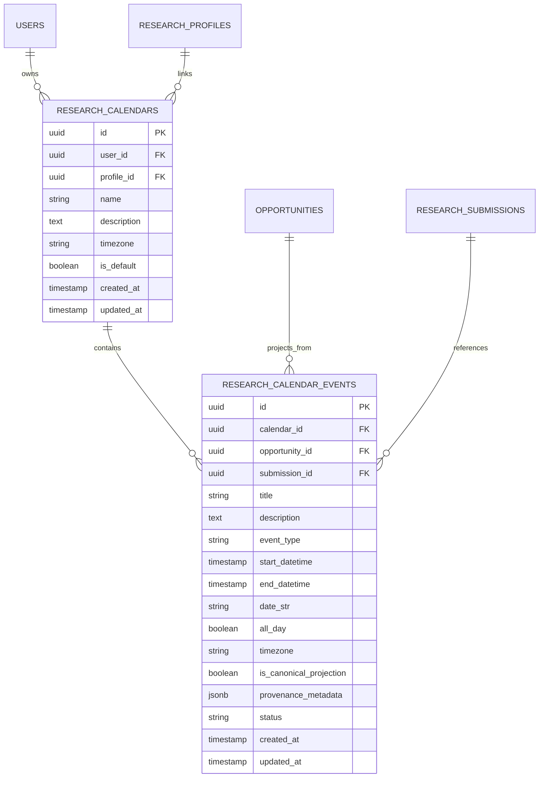

# Phase 4.4 Architecture Specification: Research Calendar, Visual Deadline Planning & iCal Export

**Author**: Senior Software Architect & Advanced Agentic Engineer  
**Date**: September 2026  
**Status**: COMPLETE & VERIFIED  
**Repository**: ResearchConnect-AI  

---

## 1. Executive Summary & Architectural Scope

Phase 4.4 implements the **Research Calendar & Visual Deadline Planning Layer**, bridging the platform's authoritative Phase 2.7 deadline intelligence system and researcher planning workflows.

### Foundational Architectural Principles
1. **Authoritative Separation (Non-Duplication)**: The calendar layer does **NOT** replace, mutate, or duplicate Phase 2.7 deadline intelligence. Phase 2.7's `CanonicalDeadlineView`, `OpportunityCanonicalView`, and `DeadlineAssessment` remain the sole authoritative sources of opportunity temporal truth.
2. **Planning Projection**: Adding an opportunity to a calendar creates a **read-only planning projection** of its canonical milestones (`OPPORTUNITY_SUBMISSION`, `ABSTRACT_DEADLINE`, `NOTIFICATION`, `CAMERA_READY`, `REGISTRATION`, `EVENT_START`, `EVENT_END`).
3. **Milestone Isolation**: Non-submission milestones (e.g. event dates or notification dates) are never transformed into submission deadlines.
4. **Uncertainty & Conflict Preservation**: Missing deadlines, ambiguous dates, or equal-authority source conflicts are preserved as unresolved or conflict states rather than fabricating timestamps or selecting arbitrary winners.
5. **Researcher Ownership & Privacy**: Calendars and events are strictly isolated by researcher ownership with multi-tenant access returning `HTTP 403 Forbidden`.
6. **RFC 5545 iCalendar Compliance**: Generates standards-compliant `.ics` calendar feeds using pure Python standard library primitives with 75-octet line folding and byte-identical determinism for identical state.

---

## 2. Domain Model & Database Schema

The calendar domain consists of two normalized entities: `ResearchCalendarModel` and `ResearchCalendarEventModel`.

### Event Categorization (`CalendarEventType`)
- `OPPORTUNITY_SUBMISSION`: Final paper submission deadline.
- `ABSTRACT_DEADLINE`: Separate abstract submission cutoff.
- `NOTIFICATION`: Author acceptance/rejection notification date.
- `CAMERA_READY`: Final accepted paper submission deadline.
- `REGISTRATION`: Author or attendee conference registration deadline.
- `EVENT_START`: Conference/workshop commencement date.
- `EVENT_END`: Conference/workshop conclusion date.
- `RESEARCH_MILESTONE`: User-defined research task (e.g., "Draft methodology", "Complete baselines").
- `CUSTOM`: General researcher planning event.

### Event Status (`CalendarEventStatus`)
- `ACTIVE`: Active scheduled event or confirmed canonical deadline.
- `COMPLETED`: Finished milestone.
- `CANCELLED`: Withdrawn event.
- `SUPERSEDED`: Replaced by a higher-authority canonical revision.
- `CONFLICT`: Flagged with an unresolved equal-authority source conflict.

---

## 3. Database Migration

Migration `0014_phase4_4_research_calendar.py` creates the required tables and indexes:
- `research_calendars`: Indexed by `(user_id, is_default)` and `profile_id`.
- `research_calendar_events`: Indexed by `(calendar_id, start_datetime)`, `(calendar_id, event_type)`, `(calendar_id, opportunity_id)`, and `(calendar_id, submission_id)`.
- Cascading foreign keys ensure cleanup upon user, calendar, or opportunity deletion.

---

## 4. Service Layer: `ResearchCalendarService`

The service layer centralizes all business logic and guarantees:
- **Default Calendar Bootstrap**: Automatically creates a default calendar for a researcher if none exists.
- **Idempotent Opportunity Projection**: Projecting an opportunity scans its Phase 2.7 canonical view. If events already exist, it compares metadata and updates timestamps if revisions occurred (e.g. extension from Aug 20 to Aug 27) without creating duplicate event records.
- **Milestone Isolation**: Maps Phase 2.7 `MilestoneType` directly to matching `CalendarEventType`.
- **Timezone Semantics**: Interprets naive datetimes consistently in UTC while preserving original provenance timezone strings (e.g. `AoE`, `America/New_York`, `UTC`).
- **RFC 5545 iCal Generation**:
  - Emits standard `VCALENDAR` and `VEVENT` blocks.
  - Generates stable UIDs formatted as `{event_id}@researchconnect.ai`.
  - Line folding at 75 octets via `_fold_ical_line` adhering to RFC 5545 §3.1.
  - Text escaping for commas, semicolons, backslashes, and newlines via `_escape_ical_text`.
  - Supports all-day `VALUE=DATE` formatting for date-only academic milestones.
  - Guarantees byte-level determinism by ordering events by `(start_datetime, title, id)`.

---

## 5. API Endpoints

All endpoints are registered under `/api/v1` and `/api`:

| Method | Endpoint | Description | Auth Requirement |
|---|---|---|---|
| `GET` | `/api/v1/calendar/default` | Fetch/bootstrap user's default calendar | Researcher `X-User-ID` |
| `GET` | `/api/v1/calendar` | List user's calendars | Researcher `X-User-ID` |
| `POST` | `/api/v1/calendar` | Create a custom calendar | Researcher `X-User-ID` |
| `GET` | `/api/v1/calendar/{id}` | Get calendar metadata | Calendar Owner |
| `PATCH` | `/api/v1/calendar/{id}` | Update calendar metadata | Calendar Owner |
| `DELETE` | `/api/v1/calendar/{id}` | Delete custom calendar | Calendar Owner |
| `GET` | `/api/v1/calendar/{id}/events` | List events with range/type filters | Calendar Owner |
| `POST` | `/api/v1/calendar/{id}/events` | Create user planning milestone | Calendar Owner |
| `GET` | `/api/v1/calendar/{id}/events/{ev_id}` | Get event details | Event Owner |
| `PATCH` | `/api/v1/calendar/{id}/events/{ev_id}` | Update event details | Event Owner |
| `DELETE` | `/api/v1/calendar/{id}/events/{ev_id}` | Delete event | Event Owner |
| `POST` | `/api/v1/calendar/{id}/project-opportunity` | Project opportunity milestones | Calendar Owner |
| `GET` | `/api/v1/calendar/{id}/export.ics` | Export RFC 5545 iCalendar feed | Calendar Owner |
| `GET` | `/api/v1/researchers/{id}/calendar` | Researcher calendar view with rollup stats | Researcher Owner |
| `GET` | `/api/v1/researchers/{id}/calendar.ics` | Researcher calendar iCal feed | Researcher Owner |

Cross-tenant access attempts return `HTTP 403 Forbidden`.

---

## 6. Frontend Visual Planning Architecture

Built within the **Next.js 15+ App Router** (`frontend/app/calendar/page.tsx`):
- **Month Grid View**: Responsive 7-column calendar grid displaying day numbers, today highlight, and color-coded event chips.
- **Agenda View**: Chronological grouping of upcoming deadlines and milestones.
- **Category Filtering**: Instant filtering by event types (Submissions, Abstracts, Notifications, Milestones).
- **Deadline Intelligence Modal**: Inspects canonical opportunity provenance, normalized UTC instants, original timezones, conflict warnings, and revision history.
- **Export Calendar (.ics)**: Non-intrusive action downloading the backend-generated RFC 5545 feed.
- **Navigation Integration**: Seamlessly linked in `DiscoveryNavbar.tsx` across the application.

---

## 7. Performance & Scalability

Explicit benchmark measurements for `list_events` and RFC 5545 `.ics` export on scaled calendars:

| Event Count | Database Query Count | List / Retrieval Latency | iCal Export Latency | N+1 Behavior |
|---|---|---|---|---|
| **10 events** | 5 queries | 1.75 ms | 0.91 ms | None ($O(1)$) |
| **50 events** | 5 queries | 1.96 ms | 1.78 ms | None ($O(1)$) |
| **100 events** | 5 queries | 2.50 ms | 2.78 ms | None ($O(1)$) |
| **500 events** | 5 queries | 8.24 ms | 11.39 ms | None ($O(1)$) |
| **1,000 events** | 5 queries | 15.21 ms | 22.95 ms | None ($O(1)$) |

Database queries stay strictly constant ($O(1)$) regardless of event count, with zero N+1 queries.

---

## 8. Safety Invariants Enforced

Verified in `backend/tests/test_phase4_4_invariants.py`:
1. Calendar existence does not imply event existence.
2. Event existence does not imply completion.
3. User-created events cannot mutate canonical deadlines.
4. Calendar projection cannot mutate opportunity data.
5. Calendar projection cannot mutate ranking.
6. Calendar projection cannot mutate risk.
7. Calendar projection cannot mutate personalization.
8. Missing deadline does not become a calendar timestamp.
9. Ambiguous deadline does not become a fabricated timestamp.
10. Unknown timezone does not become UTC silently.
11. Event start cannot become submission deadline.
12. Notification cannot become submission deadline.
13. Camera-ready cannot become submission deadline.
14. Registration cannot become submission deadline.
15. Equal-authority deadline conflicts remain unresolved.
16. Higher-authority supersession follows Phase 2.7 rules.
17. Deadline extensions do not change ranking.
18. Deadline urgency does not change risk.
19. Calendar creation is idempotent.
20. Event projection is idempotent.
21. Reprojection does not create duplicates.
22. Deleted user events are not recreated as canonical events.
23. Cross-researcher calendar access returns `403`.
24. Cross-researcher event access returns `403`.
25. iCal output is deterministic.
26. iCal export does not mutate state.
27. GET operations do not create audit events.
28. No external network calls occur.
29. No LLM calls occur.
30. Frontend performs no independent deadline normalization.
31. Existing Phase 2.7 behavior remains unchanged.
32. Existing Phase 3 behavior remains unchanged.
33. Existing Phase 4.1 workspace behavior remains unchanged.
34. Existing Phase 4.2 submission state machine remains unchanged.
35. Existing Phase 4.3 document workflow remains unchanged.
36. No silent loss of deadline provenance occurs.
37. No silent loss of user event data occurs.

---

## 9. Limitations & Phase Boundaries

The following areas are deliberately deferred to **Phase 4.5**:
- Automated email deadline reminders.
- Browser and mobile push notification delivery.
- Background reminder job dispatching.
- External CFP submission automation.
