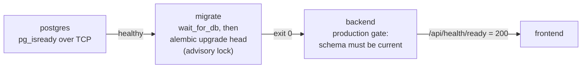

# Phase 6.5 — Database and Migration Startup

Phase 6.5 makes the path from an empty database to a working application explicit, checked
and tested. The Phase 6 specification defines the scope:

> A fresh PostgreSQL environment must support: database creation → PostgreSQL ready →
> Alembic upgrade head → backend starts → application works. Verify the migration chain from
> an empty database. Do not modify migrations merely to make tests easier.

The Phase 6 reconnaissance also assigned one defect here: the fresh-database migration test was
pinned to an old revision (D2). No migration was modified in this phase.

## 1. Findings

Measured on empty PostgreSQL 16 + pgvector 0.8.6 databases before any change:

| # | Finding | Evidence |
|---|---|---|
| F1 | **The chain itself is sound.** `alembic upgrade head` applies all 28 revisions to an empty database; `downgrade base` and a second `upgrade head` both succeed. | Upgrade 1.7 s, round trip 2.8 s. |
| F2 | **The only fresh-database guard had stopped guarding (D2).** `test_alembic_postgres_integration.py` asserted revision `0024` while head is `0028`, so it failed whenever it was opted in. Being opt-in, nobody noticed for four revisions. | Opted in on the previous code: `assert '0028_phase5_...' == '0024_phase6_feedback_history'`. |
| F3 | **Healthy did not mean usable.** `/api/health` never touches the database, and the Compose healthcheck used it, so the backend reported healthy (and the frontend started) with the database down or the schema behind. | Code inspection. |
| F4 | **Nothing checked the schema against the code.** A backend started without migrations (on the host, or code deployed without running `migrate`) served requests and failed on the first query touching a missing table. That is how the Phase 3.6/3.7 tables once shipped without a migration and returned 500. | Phase 6 history (roadmap §7.2). |
| F5 | **Overlapping migration runs were ordered only by accident.** The pre-flight `ALTER TABLE alembic_version` waits for another run's open migration transaction, which serializes most overlaps. Two runs that both pass the pre-flight before either reads the version table start from the same revision; the loser exits non-zero. | Two concurrent runs on a fresh database both succeeded, with the second blocked on that `ALTER`. The remaining window is milliseconds wide. |
| F6 | **The migrated schema has everything the models declare, structurally.** Every table and column exists with the declared type and nullability, and every declared unique rule exists (sometimes under another name). | `alembic.autogenerate.compare_metadata` against a fresh database; see §6. |

## 2. What changed

| Change | Where | Addresses |
|---|---|---|
| `GET /api/health/ready`: 200 only when the database answers and its schema is this build's Alembic head, 503 otherwise | `app/api/health.py`, `app/db/schema_status.py` | F3 |
| Compose gates the frontend on readiness instead of liveness | `docker-compose.yml` (backend healthcheck) | F3 |
| Production startup gate: the backend refuses to start unless the schema is current | `app/scheduler/lifecycle.py` (`verify_database_schema`) | F4 |
| Migration runs take a PostgreSQL advisory lock for their whole duration | `alembic/env.py` | F5 |
| Fresh-database test rewritten: head derived from the scripts, plus parity, idempotency, round trip and concurrency | `tests/test_alembic_postgres_integration.py` | F2, F6 |
| Chain and startup tests that need no database server | `tests/test_database_startup.py` | F1–F5 |

`/api/health` is unchanged: it is the liveness probe and still touches nothing.

### 2.1 Schema status

`app/db/schema_status.py` reads `alembic_version` and compares it with the head of the
migration scripts shipped in the same build (loaded once per process from `backend/alembic`).

| `schema` | Meaning | Ready? |
|---|---|---|
| `current` | The database is at this build's head | yes |
| `behind` | An older revision of this build; run `alembic upgrade head` | no |
| `unrecognized` | A revision this build does not ship: the database was migrated by newer or other code | no |
| `uninitialized` | No revision recorded; migrations never ran | no |
| `unknown` | The database could not be asked (`database: unreachable`) | no |
| `not_checked` | Not PostgreSQL (the SQLite test databases are built from the models) | yes |

### 2.2 Readiness endpoint

```
GET /api/health/ready
200 {"status": "ready",     "database": "ok",          "schema": "current"}
503 {"status": "not_ready", "database": "ok",          "schema": "behind"}
503 {"status": "not_ready", "database": "unreachable", "schema": "unknown"}
```

The body carries coarse states only. The revisions involved go to the server log
(`not ready: database=ok schema=behind (found: 0027_…; expected: 0028_…)`), not to the
unauthenticated response. The endpoint uses the request's database session, like every
other route.

### 2.3 Production startup gate

With `APP_ENV=production`, the application lifespan checks the schema before anything else,
including the scheduler. Anything but `current` stops startup:

```
SchemaNotReadyError: Refusing to start: database=ok schema=behind (found: 0027_phase5_11_openings_and_applications;
expected: 0028_phase5_12_peer_discovery). run `alembic upgrade head` (the Compose `migrate` service does this)
before starting the API
ERROR:    Application startup failed. Exiting.
```

Under Compose the container restarts (`restart: unless-stopped`) and comes up by itself once
the schema is migrated. Outside production the gate is skipped, so the test suite and the host
development loop open no connection at startup; `/api/health/ready` still reports the state.

### 2.4 Migration lock

`alembic/env.py` takes the session-level advisory lock `MIGRATION_LOCK_KEY` (defined in
`app/db/schema_status.py`, derived like the scheduler's lock keys in its own namespace) before
the version-table pre-flight, and releases it after the migration transaction. A second run
waits, starts after the first has committed, finds the database at head, and does nothing. If
a run dies, the server releases the lock with its connection. The P0 pre-flight that widens
`alembic_version.version_num` is unchanged.

## 3. Startup sequence



Each arrow is a Compose `depends_on` condition. The same order applies on a host: start
PostgreSQL, run `cd backend && alembic upgrade head`, then start the API.

## 4. Verification

Measured with the real `docker-compose.yml` under an isolated project name, a fresh volume,
separate ports and image tags.

**Fresh volume to working stack in 20.4 s** (`docker compose up -d --wait` with prebuilt
images; times from PostgreSQL's container start):

| Step | At |
|---|---|
| PostgreSQL healthy, `migrate` starts | +5.7 s |
| `migrate`: database reachable on the first attempt, 28 revisions applied, exit 0 | +8.2 s (2.5 s of migration) |
| Backend startup check passes: `schema=current (0028)` | +10.8 s |
| Backend ready (healthcheck), frontend starts | +14.0 s |
| Frontend healthy, command returns | about +20 s |

**The application works on the fresh schema**: 14 of 14 smoke checks passed. They cover
liveness and readiness, registering a new account, signing in, `/auth/me` with the bearer
token, workspace, notifications, postings and personalization settings (Phase 4, 4.5, 5.10 and
5.9 tables), literature search (full-text and pgvector columns), refusal of an unauthenticated
request, and the frontend's `/`, `/login` and `/register`.

**Failure and recovery scenarios**, on the running stack:

| Scenario | Result |
|---|---|
| Schema moved back one revision | Readiness `503 schema=behind`; liveness stays 200; revisions logged server-side |
| Backend restarted against that schema | Refused to start with the message in §2.3; Docker kept retrying |
| `migrate` run again | Applied the one missing revision; the backend came up by itself and reported ready |
| PostgreSQL stopped | Readiness `503 database=unreachable`; liveness stays 200 |
| PostgreSQL started again | Ready again without restarting the backend |
| `down` and `up` keeping the volume | 0 migrations applied, ready in 19.6 s |
| Two `migrate` containers at once, schema one behind | Both exit 0; exactly one applied the revision |

## 5. Tests

`tests/test_database_startup.py` runs in the ordinary suite, without PostgreSQL:

- **Chain.** Exactly one head. The chain is linear from an empty database, every revision has
  `upgrade()` and `downgrade()`, and every ID fits the widened version column.
- **Classification.** Recorded revisions are classified against the head.
- **Readiness.** 200 only when `current` (or SQLite), 503 for each other state and for an
  unreachable database. Revisions stay out of the response, and liveness never queries.
- **Startup gate.** Production refuses a schema that is not current before building the
  scheduler, starts once it is current, and development and test open no connection. The
  refusal names the state, the revisions and the fix.
- **Wiring.** Compose migrates before the API and gates the frontend on readiness, and
  `env.py` takes the lock before the pre-flight.

`tests/test_alembic_postgres_integration.py` is opt-in (`RUN_POSTGRES_MIGRATION_TESTS=1`,
with a `DATABASE_URL` role that may create databases). Each test uses its own temporary
database:

- **Fresh upgrade.** Reaches the script head and installs pgvector without `init.sql`, and the
  backend reports `uninitialized`, then `current`.
- **Idempotency.** A second `upgrade head` applies nothing.
- **Readiness on real SQL.** Readiness follows `downgrade -1` (`behind`), upgrade (`current`)
  and a foreign revision (`unrecognized`).
- **Model parity.** No table, column, type or nullability difference against the models, and
  no missing unique rule.
- **Round trip.** `downgrade base` leaves only `alembic_version`, and `upgrade head` returns to
  head.
- **Concurrency.** Two runs both block on the lock while it is held; released, both exit 0 and
  exactly one migrates. With the lock disabled this test fails.

## 6. Known limitations and follow-ups

- **Model-declared indexes that no migration creates.** 37 plain single-column indexes exist
  on the models (`index=True`) but not in the database. They are mostly on low-cardinality
  columns such as `status`, `priority`, `dimension` and `signal_value` in the personalization,
  workspace, task, invitation, notification and interaction tables. Every query is correct
  without them. Whether any are worth their write cost is a measurement for the Phase 6.8/6.9
  performance audit, not a startup change, so no migration adds them here. The parity test
  allows these and column comments (present only on the models), and fails on anything
  structural.
- **Database-only indexes.** The HNSW, GIN, content-hash and similar indexes that the database
  has but the models do not declare are intentional: migrations own them.
- **`init.sql` is now optional.** Migration `0001` installs pgvector and `env.py` widens the
  version table. The Compose volume still runs `init.sql` on first start, which is harmless.
  On a managed PostgreSQL, the migration role needs permission to create the `vector`
  extension, or the extension must be enabled beforehand.
- **Downgrades are not a rollback strategy.** Every downgrade works, but they drop data. Take
  a backup (see the database guide) before moving a production database backwards.
- **One head only.** The chain test fails if two migrations branch from the same parent; merge
  them before release.
